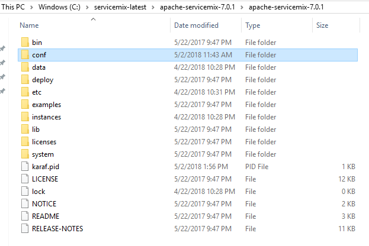
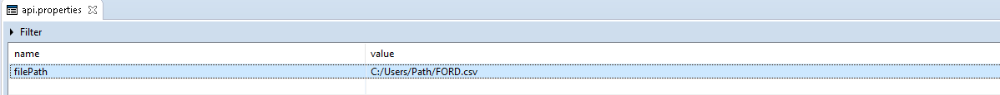
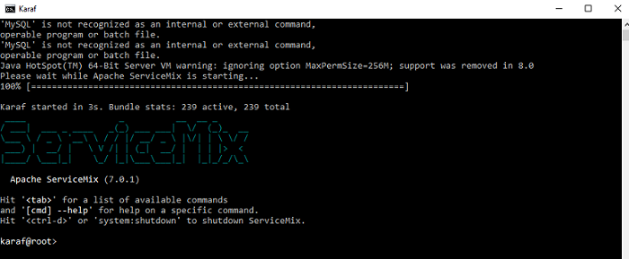
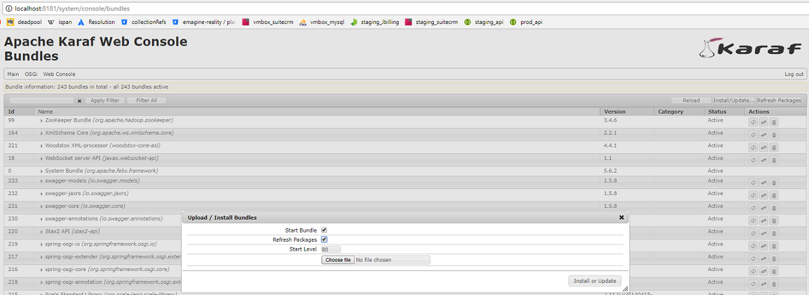
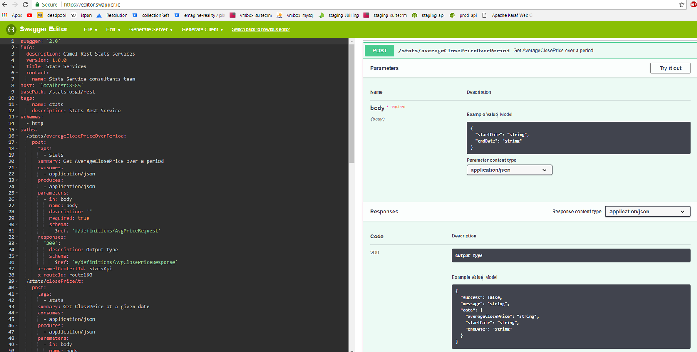
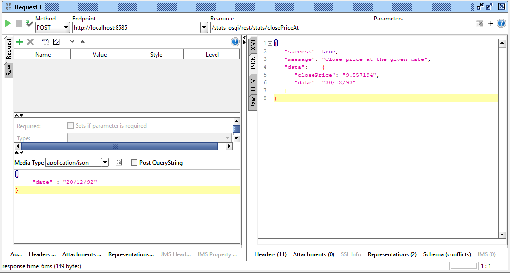
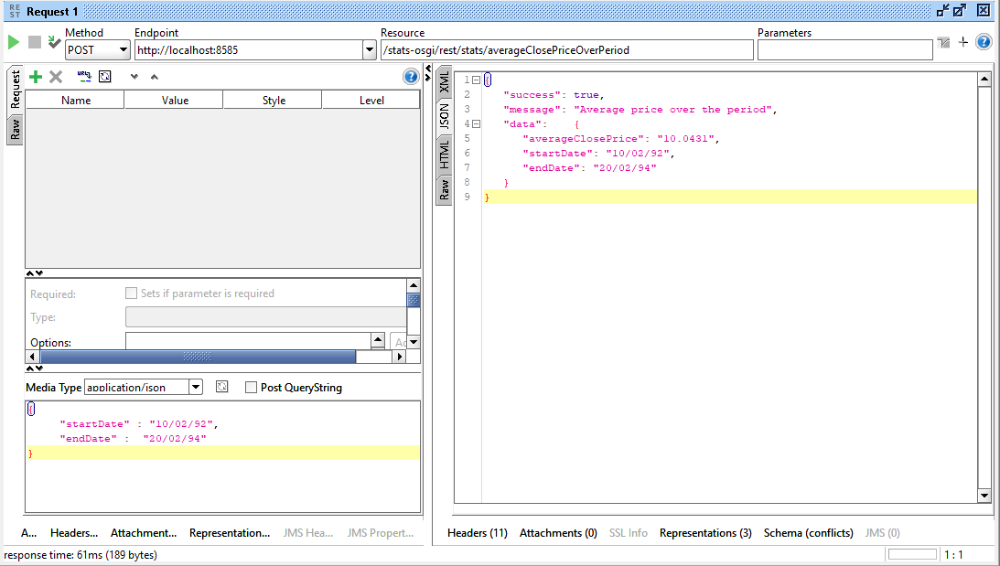
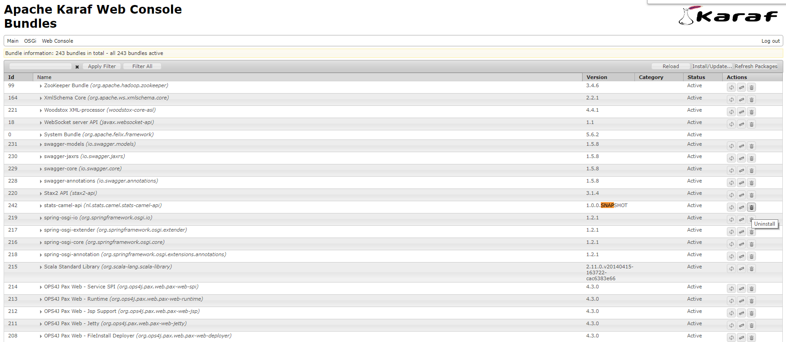

# Overview

This project is a camel api implementation with the main functionality to process the given historical stock data of a given company in a predefined .csv format and expose certain functional endpoints that will manipulate and transform the existing historical data via a predefined statistical transformation. 

Such as : 
    
    exposing the close price info at a given date.
    exposing the average close price of a stock between a given interval.  

The resource csv file thats been used is "FORD.csv", which is under /test folder of the project. 

# Deployment

In the development and deployment apache-servicemix-7.0.1.zip version is used, and you can install it via the following link:

http://www.apache.org/dyn/closer.lua/servicemix/servicemix-7/7.0.1/apache-servicemix-7.0.1.zip

ServiceMix does not come with a default configuration folder which the installed bundles can refer seamlessly, so for this project we create a new folder "conf" under */apache-servicemix-7.0.1 path.  

and later on we put our /test/api.properties file under the conf directory. YOU NEED TO UPDATE THE API.PROPERTIES FILE with the exact path of your local copy of the "FORD.csv" file.

later on you can run the servicemix via the command "/apache-servicemix-7.0.1/bin/servicemix.bat". 

When it is initially started there are couple of additional features that needs to be installed that are ready to be installed but doesnt come as installed in the servicemix version. You can install them as follows;

Running on Karaf command line:

    feature:install webconsole
    feature:install camel-swagger-java
    feature:install camel-jackson
    feature:install camel-jetty9

Click on:
      
http://localhost:8181/system/console/bundles

And make sure that your [8181,8585] ports are not allocated to some other operations in your machine.

If the servicemix has not been installed before, initially it might ask for a username/password to reach the webconsole features.

username : smx
     
           
password : smx
       

       
This is the main bundle list view and where the stats-api is going to be installed. After a "mvn clean install" the jar file created should be under your local maven directory as stated on the command line. 

Ex: 
      
      nl/stats/camel/stats-camel-api/1.0.0-SNAPSHOT/stats-camel-api-1.0.0-SNAPSHOT.jar

      
You can install the bundle via the the Install/Update button. Do not forget to check the Start Bundle, and Refresh Package checkboxes at all times.

Later on you can check the deployment of the bundle being successful or checking the logs by "log:display" on karaf command line, also if the deployment is successful and whether the stats-api is up and running or not you can check the swagger documentation for the api via the link:

http://localhost:8585/stats-osgi/rest/api-docs/statsApi

You can copy paste the content of the swagger definition above and by pasting it on the online swagger editor you can have a more clear picture of the endpoints being implemented:

https://editor.swagger.io
      

      
      
      
      
      
# Testing

There are implemented soapui tests under "/test/soap/" directory. The request and response objects are designed to be mapped into their json equivalent class models which are referred also in the camel.xml file.

closePriceAt call :
      
     

      
       
      
averageClosePriceOverPeriod call :

      
      
 
 
 You can choose to remove the bundle from the servicemix once you are finished, and repeat the process once again.
 
 

 
      
      